# Trabajo Práctico 5 – InfoMed  
**Materia:** Bases de Datos  
**Institución:** ITBA  
**Profesores:** Eugenia Berrino, Melina Piacentino, Carlos Lazzarino, Ingrid Celia Spessotti 
**Integrantes:**  
- Orbe, Lucas   
- Sanchez, Camila  

---

## Parte 1: Bases de Datos – Centro Médico

###  Base de datos centro médico

Se desea diseñar una base de datos relacional que almacene la información sobre los pacientes, médicos, recetas y consultas en un centro de salud. En la actualidad, la gestión de esta información se lleva a cabo del siguiente modo:

Cuando una persona acude al centro de salud, se le toma nota en una ficha con sus datos personales: nombre, fecha de nacimiento, sexo biológico y dirección (calle, número y ciudad). Esta ficha queda registrada en el archivo de pacientes del centro.

Los médicos del centro también tienen su ficha, donde se registran su nombre completo, especialidad y dirección profesional.

Cada vez que un médico realiza una consulta o tratamiento a un paciente, puede emitir una receta. Esta receta incluye la fecha, el nombre del paciente atendido, el médico que la emite, el medicamento o tratamiento indicado, y la enfermedad o condición que motivó la prescripción. Esta información queda registrada y organizada para facilitar tanto el seguimiento del paciente como las auditorías clínicas.

Los tratamientos pueden incluir medicamentos, indicaciones como reposo o fisioterapia, y suelen tener especificaciones temporales (por ejemplo, “tomar por 5 días” o “uso indefinido”). También se registran enfermedades o diagnósticos asociados, permitiendo análisis estadísticos o seguimiento epidemiológico.

El sistema busca reemplazar los registros en papel por una solución digital que permita realizar búsquedas rápidas, obtener estadísticas de distribución demográfica, sexo y especialidad, y mantener la información organizada para su integración con otros módulos médicos como historiales clínicos, turnos o recetas médicas.

> Nota: La implementación hecha por la cátedra de esta base de datos está en el archivo previamente compartido `base_de_datos.sql`.

---

### Consignas Parte 1:

1. ¿Qué tipo de base de datos es? Clasificarla según estructura y función.  
2. Armar el diagrama entidad-relación de la base de datos dada.  
3. Armar el modelo lógico entidad-relación de la base de datos dada.  
4. ¿Considera que la base de datos está normalizada? En caso que no lo esté, ¿cómo podría hacerlo?  
> Nota: No debe normalizar la base de datos, solo explicar cómo lo haría.

> **Aclaración:** Si se consideran otras formas de resolver el diseño de la base de datos, o si desean incorporar tablas de referencia adicionales, pueden hacerlo. Se valorará que le den su propio enfoque al modelo. Toda decisión que tomen y no esté explícita en los requisitos dados se deben describir y justificar en el informe.

### Resoluciones Parte 1:

1. Es una base de datos relacional, ya que la información se organiza en tablas relacionadas entre sí mediante claves primarias y foráneas. Según su función es una base de datos transaccional, utilizada para el almacenamiento, consulta y modificación de datos del día a día en el centro médico (pacientes, médicos, medicamentos, tratamiento)
2. <p align="center">
  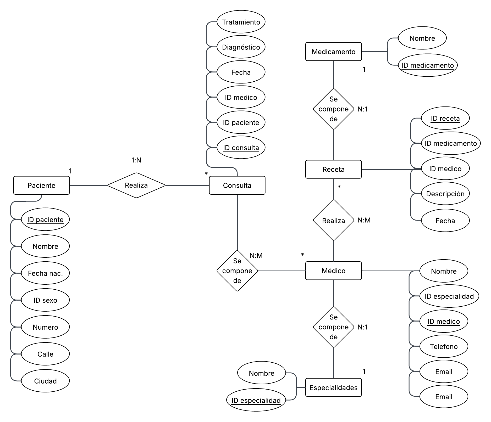
</p>
3. Se uso la pagina: https://dbdiagram.io/d

<p align="center">
  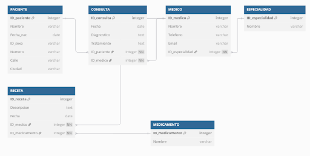
</p>

4. La base de datos está normalizada porque cumple con las tres primeras formas normales:
- Cumple Primera Forma Normal (1FN) porque todos los atributos contienen valores atómicos y no hay grupos repetitivos; por ejemplo, la dirección está correctamente separada en calle, número y ciudad.
- Cumple la Segunda Forma Normal (2FN) porque todas las tablas con clave primaria tienen atributos no clave que dependen completamente de la clave, sin dependencias parciales. 
- Cumple la Tercera Forma Normal (3FN) porque no hay dependencias transitivas entre los atributos no clave: cada atributo depende directamente de la clave primaria de su tabla y no de otros campos. Por ejemplo, la información sobre especialidades médicas se guarda en una tabla aparte y no como texto repetido en la tabla de médicos.

  
Esto garantiza que los datos estén organizados de forma eficiente, se minimicen las redundancias y se facilite el mantenimiento de la base.

---

## Parte 2: SQL

###  Consignas

1. Cuando se realizan consultas sobre la tabla `paciente` agrupando por ciudad los tiempos de respuesta son demasiado largos. Proponer mediante una query SQL una solución a este problema.  
2. Se tiene la fecha de nacimiento de los pacientes. Se desea calcular la edad de los pacientes y almacenarla de forma dinámica en el sistema ya que es un valor típicamente consultado, junto con otra información relevante del paciente.  
3. La paciente, “Luciana Gómez”, ha cambiado de dirección. Antes vivía en “Avenida Las Heras 121” en “Buenos Aires”, pero ahora vive en “Calle Corrientes 500” en “Buenos Aires”. Actualizar la dirección de este paciente en la base de datos.  
4. Seleccionar el nombre y la matrícula de cada médico cuya especialidad sea identificada por el id 4.  
5. Puede pasar que haya inconsistencias en la forma en la que están escritos los nombres de las ciudades, ¿cómo se corrige esto? Agregar la query correspondiente.  
6. Obtener el nombre y la dirección de los pacientes que viven en Buenos Aires.  
7. Cantidad de pacientes que viven en cada ciudad.  
8. Cantidad de pacientes por sexo que viven en cada ciudad.  
9. Obtener la cantidad de recetas emitidas por cada médico.  
10. Obtener todas las consultas médicas realizadas por el médico con ID igual a 3 durante el mes de agosto de 2024.  
11. Obtener el nombre de los pacientes junto con la fecha y el diagnóstico de todas las consultas médicas realizadas en agosto del 2024.  
12. Obtener el nombre de los medicamentos prescritos más de una vez por el médico con ID igual a 2.  
13. Obtener el nombre de los pacientes junto con la cantidad total de recetas que han recibido.  
14. Obtener el nombre del medicamento más recetado junto con la cantidad de recetas emitidas para ese medicamento.  
15. Obtener el nombre del paciente junto con la fecha de su última consulta y el diagnóstico asociado.  
16. Obtener el nombre del médico junto con el nombre del paciente y el número total de consultas realizadas por cada médico para cada paciente, ordenado por médico y paciente.  
17. Obtener el nombre del medicamento junto con el total de recetas prescritas para ese medicamento, el nombre del médico que lo recetó y el nombre del paciente al que se le recetó, ordenado por total de recetas en orden descendente.  
18. Obtener el nombre del médico junto con el total de pacientes a los que ha atendido, ordenado por el total de pacientes en orden descendente.  

### Resoluciones Parte 1:
1. ```sql
    SELECT
    COUNT(id_paciente),
        ciudad
    FROM
    Pacientes
    group by
    CIUDAD;

Output:
<p align="center">
  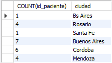
</p>

2. ```sql
    CREATE VIEW EdadesPacientes AS
    SELECT
    id_paciente,
        nombre,
    fecha_nacimiento, 
    TIMESTAMPDIFF(YEAR, fecha_nacimiento, CURDATE()) AS edad
    FROM 
    Pacientes;
    SELECT * FROM EdadesPacientes
    
Output:
<p align="center">
  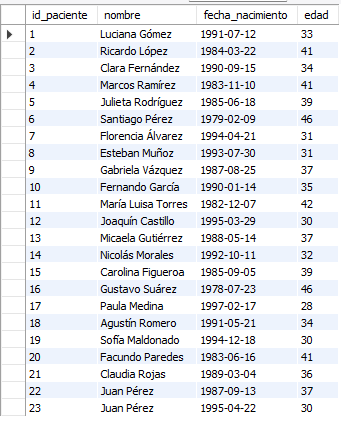
</p>

3. ```sql
    UPDATE Pacientes p
    JOIN (
        SELECT id_paciente
        FROM Pacientes
        WHERE nombre = 'Luciana Gomez'
          AND calle = 'Avenida Las Heras'
          AND numero = '121'
          AND (
              LOWER(ciudad) LIKE '%buenos aires%'
              OR LOWER(ciudad) LIKE '%bs aires%'
              OR LOWER(ciudad) LIKE '%bs as%'
          )
    ) AS sub ON p.id_paciente = sub.id_paciente
    SET p.calle = 'Corrientes',
        p.numero = '500';
    SELECT * FROM Pacientes;

Output:
<p align="center">
  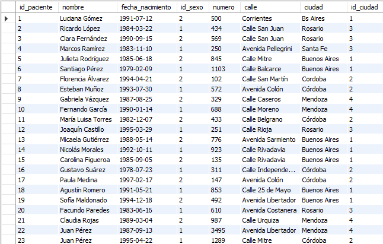
</p>

4. ```sql
    SELECT
    nombre,
        matricula
    FROM
    Medicos
    WHERE especialidad_id = 4;

Output:
<p align="center">
  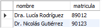
</p>
    
5. ```sql
    SET SQL_SAFE_UPDATES = 0;
    
    CREATE TABLE Ciudades (
        id_ciudad INT AUTO_INCREMENT PRIMARY KEY,
        nombre_ciudad VARCHAR(100)
    );
    
    INSERT INTO Ciudades (nombre_ciudad) VALUES
    ('Buenos Aires'),
    ('Córdoba'),
    ('Santa Fe'),
    ('Mendoza'),
    ('Rosario');
    
    ALTER TABLE Pacientes 
    ADD COLUMN id_ciudad INT;
    ALTER TABLE Pacientes 
    ADD CONSTRAINT fk_pacientes_ciudad
    FOREIGN KEY (id_ciudad) REFERENCES Ciudades(id_ciudad);
        
    
    UPDATE Pacientes p
    JOIN (
        SELECT id_paciente
        FROM Pacientes
        WHERE LOWER(ciudad) IN ('buenos aires', 'bs aires', 'buenos aiers', 'buenos  aires', ' buenos aires')
    ) AS filtro ON p.id_paciente = filtro.id_paciente
    JOIN Ciudades c ON c.nombre_ciudad = 'Buenos Aires'
    SET p.id_ciudad = c.id_ciudad
    WHERE p.id_paciente IS NOT NULL;
    
    UPDATE Pacientes p
    JOIN (
        SELECT id_paciente
        FROM Pacientes
        WHERE LOWER(ciudad) IN ('cordoba', 'córodba')
    ) AS filtro ON p.id_paciente = filtro.id_paciente
    JOIN Ciudades c ON c.nombre_ciudad = 'Córdoba'
    SET p.id_ciudad = c.id_ciudad
    WHERE p.id_paciente IS NOT NULL;
    
    UPDATE Pacientes p
    JOIN (
        SELECT id_paciente
        FROM Pacientes
        WHERE LOWER(ciudad) IN ('mendoza', 'mendzoa')
    ) AS filtro ON p.id_paciente = filtro.id_paciente
    JOIN Ciudades c ON c.nombre_ciudad = 'Mendoza'
    SET p.id_ciudad = c.id_ciudad
    WHERE p.id_paciente IS NOT NULL;
    
    UPDATE Pacientes p
    JOIN (
        SELECT id_paciente
        FROM Pacientes
        WHERE LOWER(ciudad) IN ('santa fe', 'rosario')
    ) AS filtro ON p.id_paciente = filtro.id_paciente
    JOIN Ciudades c ON c.nombre_ciudad = 'Santa Fe'
    SET p.id_ciudad = c.id_ciudad
    WHERE p.id_paciente IS NOT NULL;
    
    /*ALTER TABLE Pacientes DROP COLUMN ciudad;*/yy
    
    SELECT 
    p.*,
        c.nombre_ciudad
    FROM 
    Pacientes p
    LEFT JOIN Ciudades c on p.id_ciudad = c.id_ciudad;

Output:
<p align="center">
  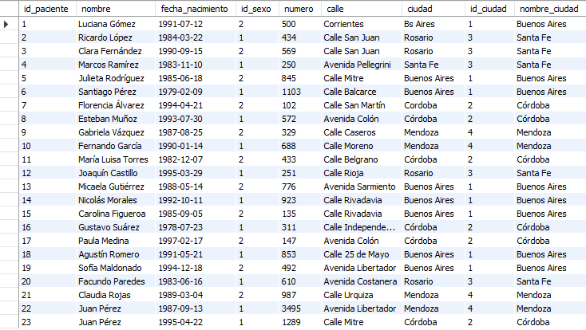
</p>

6. ```sql
    SELECT
    p.nombre,
        p.numero,
        p.calle,
        c.nombre_ciudad
    FROM
    Pacientes p
        LEFT JOIN Ciudades c ON p.id_ciudad = c.id_ciudad
    WHERE p.id_ciudad = 1;
Output:
<p align="center">
  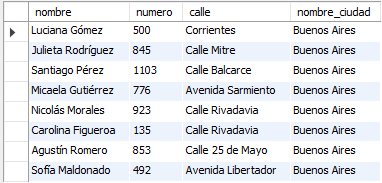
</p>

7.  ```sql
    SELECT
    count(r.id_receta) AS Cant_recetas,
        MONTH(r.fecha) AS MES,
        m.nombre AS Médico
    FROM
    Recetas r
    LEFT JOIN Medicos m ON r.id_medico = m.id_medico
    WHERE r.id_medico = 3 AND YEAR(r.fecha) = 2024 AND MONTH(r.fecha) = 08
    GROUP BY MONTH(r.fecha);
Output:
<p align="center">
  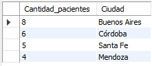
</p>

8. ```sql 
    SELECT
        SUM(case when p.id_sexo = 1 THEN 1 ELSE 0 END) AS Hombres,
        SUM(case when p.id_sexo = 2 THEN 1 ELSE 0 END) AS Mujeres,
        c.nombre_cuidad AS Cuidad
    FROM
        Pacientes p
        LEFT JOIN Cuidades c ON p.id_cuidad = c.id_cuidad
        LEFT JOIN SexoBiologico s ON p.id_sexo = c.id_sexo
    GROUP BY c.nombre_cuidad
Output:
<p align="center">
  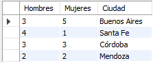
</p>

9. ```sql  

    SELECT 
    COUNT(r.id_receta) AS Cant_Recetas,
        m.nombre AS Médico
    FROM
    Medicos m
        LEFT JOIN Recetas r ON r.id_medico = m.id_medico
    GROUP BY m.nombre;
    
Output:
<p align="center">
  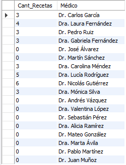
</p>

10. ```sql
    SELECT
    count(r.id_receta) AS Cant_recetas,
        MONTH(r.fecha) AS MES,
        m.nombre AS Médico
    FROM
    Recetas r
    LEFT JOIN Medicos m ON r.id_medico = m.id_medico
    WHERE r.id_medico = 3 AND YEAR(r.fecha) = 2024 AND MONTH(r.fecha) = 08
    GROUP BY MONTH(r.fecha);
Output:
<p align="center">
  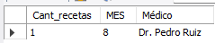
</p>


11. ```sql 
    SELECT
    	p.nombre,
        c.fecha,
        c.diagnostico
    FROM
    	Consultas c
        LEFT JOIN Pacientes p ON c.id_paciente = p.id_paciente
    WHERE MONTH(c.fecha) = 08
 Output:
<p align="center">
  
</p>       
  
    
12. ```sql 
    SELECT
    	mt.nombre AS Medicamento,
        COUNT(r.id_medicamento) AS CantVeces
    FROM
    	Recetas r
    	LEFT JOIN Medicamentos mt ON r.id_medicamento = mt.id_medicamento
    WHERE r.id_medico = 2 
    GROUP BY mt.id_medicamento
    HAVING COUNT(r.id_medicamento) > 1;
Output:
<p align="center">
  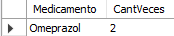
</p>

13. ```sql 
    SELECT
    	p.nombre AS Nombre,
        COUNT(r.id_receta) AS CantRecetas
    FROM
    	Pacientes p
        LEFT JOIN Recetas r ON r.id_paciente = p.id_paciente
        GROUP BY p.id_paciente;
Output:
<p align="center">
  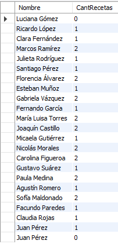
</p>    

14. ```sql
    SELECT
    	mt.nombre AS Medicamento,
        COUNT(r.id_medicamento) AS VecesRecetada
    FROM
    	Medicamentos mt
        LEFT JOIN Recetas r ON r.id_medicamento = mt.id_medicamento
    GROUP BY	
    	mt.id_medicamento
    ORDER BY
        VecesRecetada DESC
    LIMIT 1;
   
Output:
<p align="center">
  
</p>

15. ```sql 
    SELECT
    	p.nombre,
        c.fecha,
        c.diagnostico
    FROM
    	Consultas c
        LEFT JOIN Pacientes p ON c.id_paciente = p.id_paciente
    WHERE
    	c.fecha = (
    		SELECT MAX(c2.fecha)
            FROM Consultas c2
            WHERE c2.id_paciente = c.id_paciente
        )
        
Output:
<p align="center">
  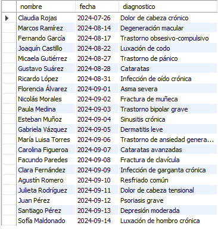
</p>  

16. ```sql 
    SELECT
    m.nombre AS Medico,
        p.nombre AS Paciente,
        COUNT(c.id_consulta) AS CantConsultas
    FROM
    Consultas c
        LEFT JOIN Medicos m ON c.id_medico = m.id_medico
        LEFT JOIN Pacientes p ON c.id_paciente = p.id_paciente
    GROUP BY
    m.id_medico, p.id_paciente;
    
Output:
<p align="center">
  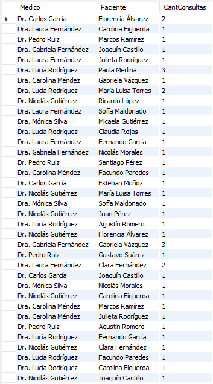
</p>
<p align="center">
  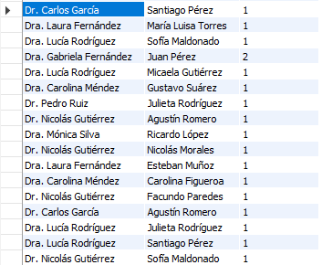
</p>


17. ```sql 
    WITH Totales AS (
        SELECT
            id_medicamento,
            COUNT(*) AS TotalRecetas
        FROM
            Recetas
        GROUP BY
            id_medicamento
    )
    SELECT
    mt.nombre,
        t.TotalRecetas,
        md.nombre,
        p.nombre
    FROM
    Recetas r
    LEFT JOIN Medicamentos mt on r.id_medicamento = mt.id_medicamento
        LEFT JOIN Medicos md ON r.id_medico = md.id_medico
        LEFT JOIN Pacientes p ON r.id_paciente = p.id_paciente
        JOIN Totales t ON r.id_medicamento = t.id_medicamento
        
    GROUP BY 
    t.id_medicamento, md.nombre, p.nombre
    ORDER BY
        t.TotalRecetas DESC;
Output:
<p align="center">
  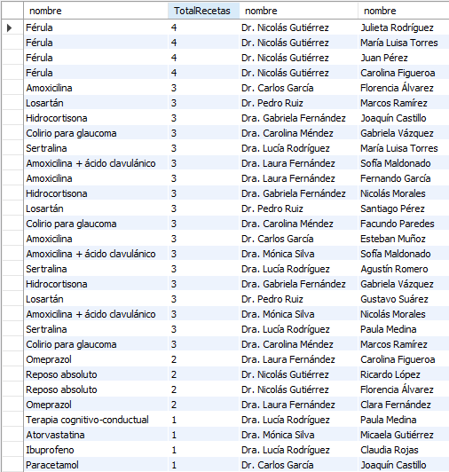
</p>

18. ```sql 
    SELECT
    md.nombre,
        COUNT(DISTINCT c.id_paciente) AS TotalPacientes
    FROM
    Consultas c
        LEFT JOIN Medicos md ON c.id_medico = md.id_medico
        LEFT JOIN Pacientes p ON c.id_paciente = p.id_paciente
    GROUP BY 
    c.id_medico
Output:
<p align="center">
  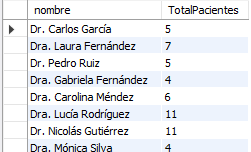
</p>
---

